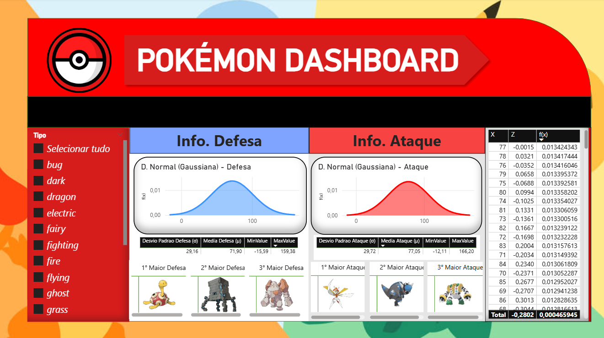

# Pokémon Dashboard: Análise Estatística e Consulta Individual

Este projeto disponibiliza um **dashboard interativo em Power BI** para análise dos **atributos dos Pokémon**, obtidos diretamente da **PokéAPI** por meio de um script Python.  
O painel oferece **visão comparativa por tipos** e **consulta detalhada** de qualquer Pokémon.

O painel permite:
- Explorar **distribuições normais (gaussianas)** de Ataque e Defesa para vários tipos simultaneamente.
- Visualizar medidas estatísticas: **média (μ)**, **desvio padrão (σ)**, **mínimo** e **máximo**.
- Identificar os **Top 1, 2 e 3** Pokémon com maior Ataque e Defesa.
- Consultar **detalhes individuais** de cada Pokémon (tipo, habilidade, altura, peso, HP, sprites, etc.).
- Navegar por três telas:  
  1. **Análise por Tipo**  
  2. **Pokémon Individual**  
  3. **Suporte/Gráficos Base**

---

<p align="center">
  
  <br>
  <em>Figura 1 - Distribuição normal de Defesa e Ataque com Top 1, 2 e 3 listados.</em>
</p>

<p align="center">
  
  <br>
  <em>Figura 2 - Comparativo entre todos os tipos de pokémon.</em>
</p>

<p align="center">
  
  <br>
  <em>Figura 3 - Consulta individual com atributos e indicadores de HP, Ataque, Defesa e Velocidade.</em>
</p>

---

## Destaques do Painel

- **Análise por Tipo:** selecione múltiplos tipos para comparar distribuições de atributos.
- **Distribuição Normal:** curva gaussiana para Ataque e Defesa, com densidade e estatísticas.
- **Top Pokémon:** exibição dinâmica do 1º, 2º e 3º colocado em Ataque e Defesa.
- **Consulta Individual:** pesquisa por nome para exibir detalhes completos (sprite, tipo, habilidade, estatísticas).
- **Gráficos de Apoio:** tabelas de densidade.

---

## Coleta de Dados

### **PokéAPI**  
- **Script:** `scripts/extrai_pokeapi.py`  
- **Endpoint:** `https://pokeapi.co/api/v2/pokemon?limit=1000`  
- **Atributos extraídos:**  
  - `ID`, `Nome`, `Altura`, `Peso`, `Base XP`  
  - `Tipos`, `Habilidades`  
  - `Stats`: HP, Ataque, Defesa, Velocidade  
  - `Sprites`: front_default, front_shiny, artwork HD  

---

## Uso do Script Python no Power BI

1. No **Power BI Desktop**, vá em **Obter Dados > Script do Python**.  
2. Copie apenas a parte do script que retorna o DataFrame `pokemon_bruto`.  
3. Configure o Python em **Opções > Script Python**.  
4. Finalize e carregue a tabela resultante.

---

## Atualizações Automáticas

Para agendar atualizações no **Power BI Service**:

1. Instale o [Power BI Gateway](https://powerbi.microsoft.com/pt-br/gateway/).  
2. Publique o arquivo `.pbix` no Power BI Web.  
3. Em **Configurações > Agendar atualização**, configure frequência diária ou conforme desejado.  

---

## Estrutura do Projeto

```plaintext
POKEMON-POWERBI/
│
├── dados/
│   ├── brutos/                   # CSV exportado pelo script
│   └── normalizados/             # Tabelas normalizadas (3FN)
│
├── docs/                              # Documentação, imagens e ilustrações
│   └── images/
│       ├── screenshots/               # Prints das telas do dashboard
│       │   ├── screenshot1.png
│       │   ├── screenshot2.png
│       │   └── screenshot3.png
│       ├── charts/                    # Prints dos gráficos auxiliares
│       └── ...                        # Png's para estilização do painel
│
├── script/                            
│   ├── dax/                           # Medidas DAX reutilizáveis
│   │   ├── Distribuicao Normal Ataque.dax
│   │   └── Distribuicao Normal Defesa.dax
│   ├── transformations/              # Scripts de transformação em Power Query
│   │   ├── pokemon_bruto.pq
│   │   ├── pokemon_dim.pq
│   │   └── ...
│   └── pokeapi_extract.py            # Script Python de coleta da PokéAPI
│
├── dashboard_pokemon.pbix            # Painel Power BI
├── README.md                         
└── .gitignore                        
