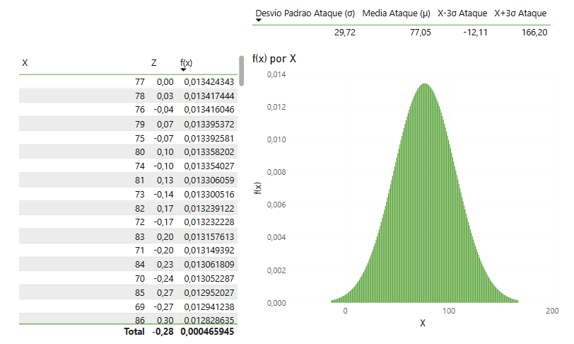

# powerbi-pokemon-dashboard
Dashboard interativo de Pokémon usando Power BI e Python com dados extraídos da PokéAPI.

## Distribuição Normal dos Atributos (Curva de Bell)
> 
Distribuição Normal do Ataque

### Função de Densidade de Probabilidade (PDF) da Normal
> .png)

