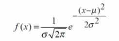

# powerbi-pokemon-dashboard

Dashboard interativo de Pokémon desenvolvido com Power BI e Python, utilizando dados da PokéAPI.  
Apresenta modelos de distribuição normal aplicados aos atributos de Ataque e Defesa, além de gráficos de dispersão para Velocidade.  
Também permite consultar informações detalhadas de cada Pokémon individualmente.

---

## Distribuição Normal dos Atributos (Curva de Bell)

  
   
  <em>Distribuição Normal do Ataque.</em>

  
   
  <em>Distribuição Normal da Defesa.</em>

---

## Estatísticas Sobre Ataque e Defesa

  
   
  <em>Resumo estatístico com curvas de distribuição e top 3 Pokémons.</em>

---

### Função de Densidade de Probabilidade (PDF) da Normal

  
   
  <em>Equação da função densidade de probabilidade da distribuição normal.</em>

