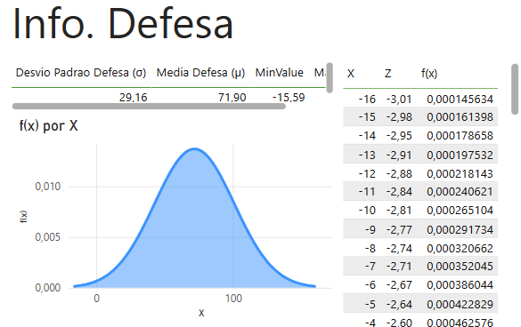
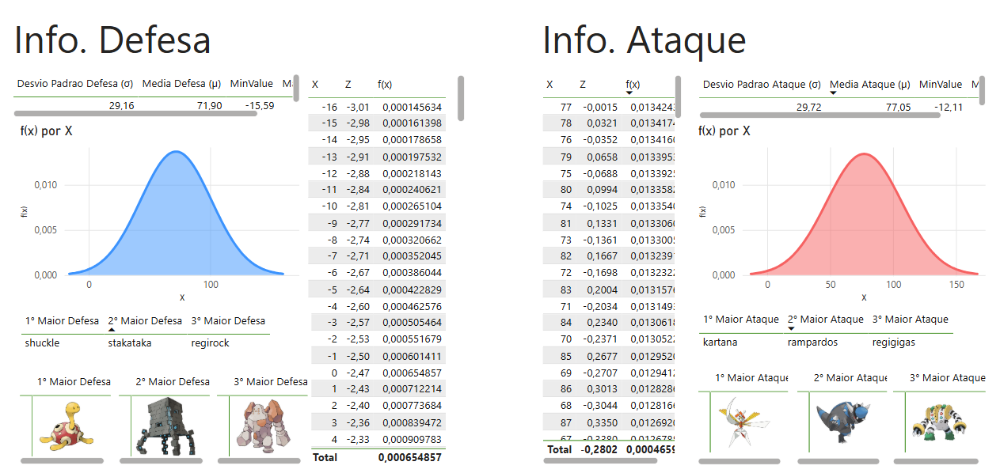

# powerbi-pokemon-dashboard
Dashboard interativo de Pokémon desenvolvido com Power BI e Python, utilizando dados da PokéAPI. Apresenta modelos de distribuição normal aplicados aos atributos de Ataque e Defesa, além de gráficos de dispersão para Velocidade. Também permite consultar informações detalhadas de cada Pokémon individualmente.

## Distribuição Normal dos Atributos (Curva de Bell)
> 
Distribuição Normal do Ataque.

> 
Distribuição Normal da Defesa.

## Estatísticas Sobre Ataque e Defesa
> 
Estatísticas Sobre Ataque e Defesa

### Função de Densidade de Probabilidade (PDF) da Normal
> .png)

